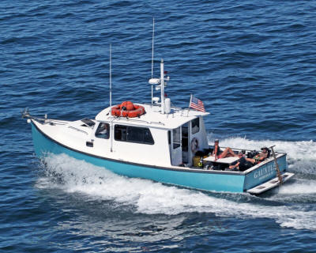
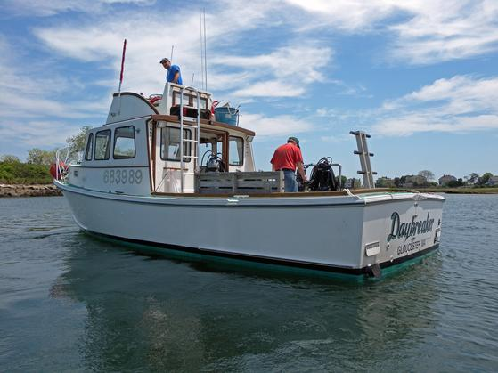
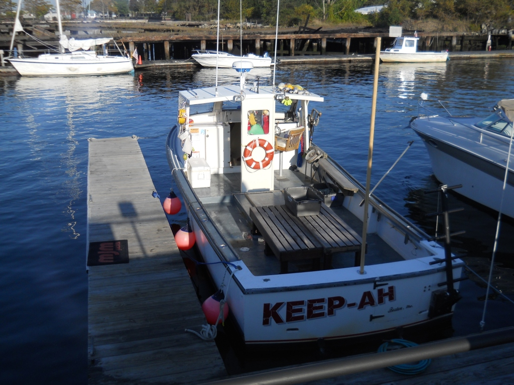
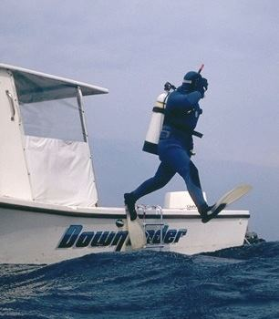

# Dive Boats

## R/V Gauntlet

Salem, MA ([Website](http://www.northernatlanticdive.com))

- **Boat**: R/V Gauntlet, 36ft Northern Bay design
- **Capacity**: 6 passengers complete with doubles, stages, DPVs
- **Speed**: 18 kts cruising

Boat custom-built for tech diving. Tanks stored bungied along the gunnels, nice
table for gearing up in middle of the deck. Very nice and long fins-on ladder.
Heated & A/C'd cabin with head and galley.

## Cape Ann Charters

Gloucester, MA ([Website](http://www.divedaybreaker.com/))

- **Boat**: Daybreaker, 32ft boat
- **Capacity**: 6 passengers

Cape Ann Charters and the Daybreaker are operated by Captn. Fran Marcoux. He
may be contacted via cell phone at (508) 335-6339 or via email:
<franm52@aol.com>.

## Boston Scuba

East Boston, MA ([Website](http://www.bostonscuba.com/))

- **Boat**: Keep-Ah
- **Capacity**: 6 passengers

Keep-Ah has all USCG mandated safety equipment. It is operated by captain Jim
Sullivan. He may be contacted at: 617-418-5555 or via email:
<bostonscubainc@gmail.com>.

## Down Under Diving Ventures

Gloucester, MA ([Website](http://www.downundercharters.com/index.html))

- **Boat**: Down Under
- **Capacity**: 6 passengers

Down Under is built for commercial use and has been re-powered in 2007 with a
new Yamaha 4 stroke 225 horsepower outboard and has all the necessary
electronics such as GPS, 3D bottom depth recorder, VHF radio. Other equipment
includes fire extinguisher, fresh water solar shower, Emergency O2 and first-aid
kit and large easy-exit dive ladder.
