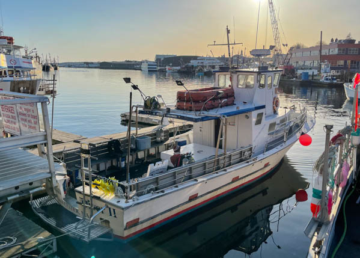

# Dive Boats

## Boston Scuba

East Boston, MA ([Website](http://www.bostonscuba.com/))

- **Boat**: Keep-Ah
- **Capacity**: 6 passengers

Keep-Ah has all USCG mandated safety equipment. It is operated by captain Jim
Sullivan. He may be contacted at: 617-418-5555 or via email:
<bostonscubainc@gmail.com>.

## R/V Gauntlet

Salem, MA ([Website](http://www.northernatlanticdive.com))

- **Boat**: R/V Gauntlet, 36ft Northern Bay design
- **Capacity**: 6 passengers complete with doubles, stages, DPVs
- **Speed**: 18 kts cruising

Boat custom-built for tech diving. Tanks stored bungied along the gunnels, nice
table for gearing up in middle of the deck. Very nice and long fins-on ladder.
Heated & A/C'd cabin with head and galley.
## Cape Ann Diver II

Gloucester, MA ([Website](https://www.capeanndiver2.com/))

- **Boat**: Cape Ann Diver II
- **Capacity**: 12 passengers

The Cape Ann Diver II is a 45-foot U.S.Coast Guard Inspected Dive Vessel built
by Chesapeake Work Boats in 1982.

The vessel features a raised enclosed wheelhouse, on-deck bench seating with
tank storage for up to 20 divers, an enclosed salon with a dinette and forward
berths, and an enclosed head.

## Down Under Diving Ventures

Gloucester, MA ([Website](http://www.downundercharters.com/))

- **Boat**: Down Under
- **Capacity**: 6 passengers

Down Under is built for commercial use and has been re-powered in 2007 with a
new Yamaha 4 stroke 225 horsepower outboard and has all the necessary
electronics such as GPS, 3D bottom depth recorder, VHF radio. Other equipment
includes fire extinguisher, fresh water solar shower, Emergency O2 and first-aid
kit and large easy-exit dive ladder.
